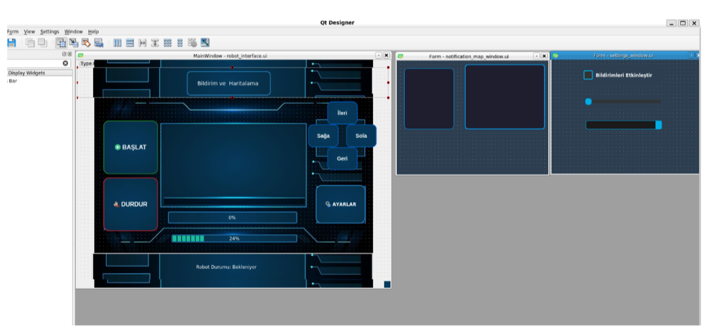
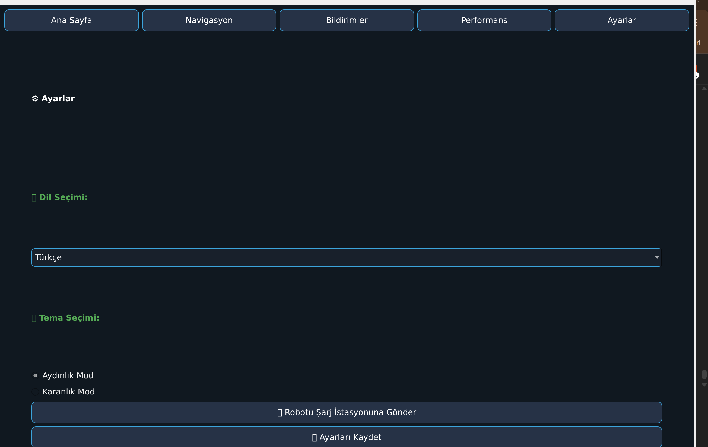
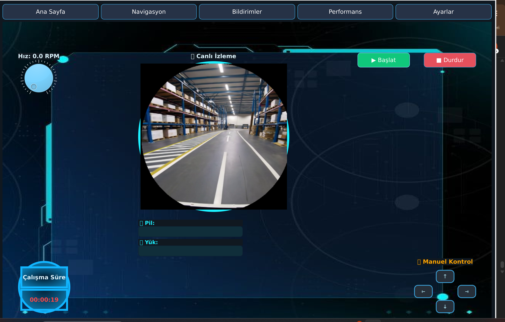

# Otonom Yük Taşıma Robotu Arayüzü

Bu proje, TÜBİTAK 2209-A kapsamında geliştirilmiş olup, endüstriyel ortamda kullanılmak üzere otonom robotlar için modern bir kullanıcı arayüzü sunmaktadır.

## 🚀 Kullanılan Teknolojiler
- Python (PyQt6)
- ROS Noetic
- OpenCV
- Qt Designer
- RViz
- ubuntu 20.04 LTS

## 🔧 Özellikler
- Canlı izleme (ROS kamera / video desteği)
- Başlat/ Durdur ve Manuel kontrol (←↑↓→)
- RPM, Pil, Yük, Çalışma Süresi göstergeleri
- Harita seçimi ve robot konum izleme
- Bildirim ve ayarlar paneli
- Performans grafikleri 

## 📁 Klasör Yapısı
- `ui/`: Arayüz sayfaları (home, navigation, style)
- `images/`: Arka plan ve test videoları
- `publisher.py`: ROS test publisher
- `doc/`: TÜBİTAK Raporları ve ek belgeler

## ℹ️ Açıklama – ROS Kamera Entegrasyonu

Bu proje kapsamında **canlı kamera izleme** için şu anda `OpenCV` üzerinden `.mp4` uzantılı bir test videosu gösterilmektedir.  

Gerçek bir robot sistemiyle çalışırken ROS üzerinden `/camera/image_raw` topic'ine abone olacak şekilde tasarlanmıştır.  
Yani `cv_bridge` ve `sensor_msgs/Image` kullanımına dair satırlar **yorum satırı** olarak bırakılmıştır.

🔁 Gerçek robot entegresi sağlandığında, bu satırlar yorumdan çıkarılarak sistem doğrudan **ROS kamera veri akışıyla** çalışacaktır.

## 📸 Ekran Görüntüsü
Arayüz akış Diyagramı:

ROS Topicleri ve Fonksiyonlar Arasında Etkileşim Şeması:

Arayüz(anasayfa):

Ayarlar Sayfası:

Navigasyon Paneli:  

Performans Grafikleri:

Bildirim Paneli:

## 👩‍💻 Geliştirici
- Özlem ALTINTAŞ | @ozlem-wq

## 📄 Lisans
MIT Lisansı
